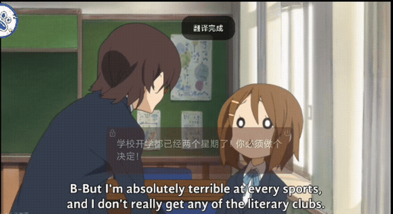
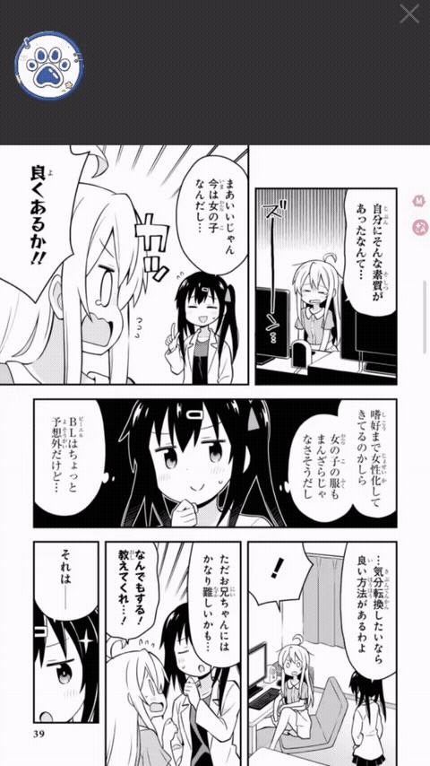
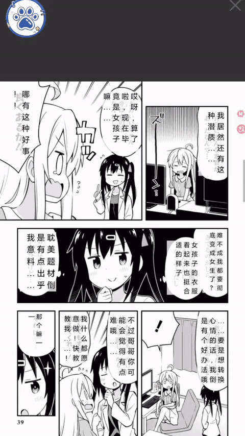
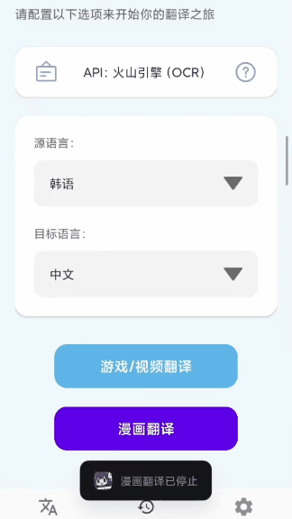
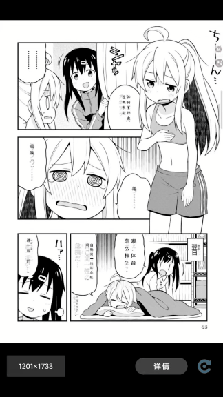

# StarFlow（星译）

<p align="center">
  
</p>

<p align="center">
  <b>开源 Android OCR + AI 翻译 App</b><br>
  游戏翻译 · 视频翻译 · 漫画翻译 | 完全免费 · 无广告 · 开源<br>
  支持 Android 11+（API 29+）| 仅 arm64-v8a
</p>

---

## 为什么选择 StarFlow

相较于传统 OCR 翻译 App：

1. **项目完全开源** — LGPL 协议，无病毒、无广告、无付费墙
2. **专用日漫识别模型** — 集成 manga-ocr，大幅提高竖排日文识别精度
3. **全自动翻译模式** — 检测屏幕变化自动触发翻译，解放双手
4. **零成本接入 AI 大模型** — 内置火山/DeepSeek/通义千问/智谱等接口，填 Key 即用
5. **完善的翻译历史管理** — 双视图、进程分组、重新翻译、打包下载
6. **精确缓存命中机制** — pHash 相似度匹配，翻过的页面秒开，大幅降低 API 消耗
7. **本地离线翻译引擎（Hy-MT2）** — 内置 1.8B 本地翻译模型，翻译完全离线，不上传文本
8. **OCR 引擎统一选择层** — 模型管理页一键切换 OCR 引擎组合（ML Kit/PP-OCRv6/PP-OCRv5/RT-DETR+manga），游戏/漫画/首页全同步，源语言随引擎自动适配

---

## 功能详解

### 多场景翻译

<p align="center">
  <br>
  <em>游戏翻译</em>
</p>

悬浮窗覆盖翻译，支持像素驱动自动翻译和手动框选两种模式。YIQ 感知色彩差异检测画面变化，翻页自动触发 OCR + 翻译，稳定页面智能跳过避免重复识别。悬浮球单击/双击/长按可自由分配动作（翻译/菜单/自动翻译）。

<p align="center">
  <br>
  <em>视频翻译</em>
</p>

同游戏翻译引擎，适用于视频字幕、直播弹幕等动态场景。关闭翻页稳定性检测后实现低延迟实时同步翻译。

<p align="center">
  
  &nbsp;&nbsp;
  
  <br>
  <em>漫画翻译 &nbsp;|&nbsp; 稳定性检测 &nbsp;|&nbsp; 缓存命中</em>
</p>

气泡检测 + OCR + 翻译 + 竖排渲染，4 种检测引擎 + 4 种 OCR 引擎可自由组合。超 6 个气泡增量渲染分批提速，pHash 检测页面变化自动翻页。实时渲染共享层：译文/原文/纯原图三态切换、气泡点击复制原文/译文、翻译缓存相似度匹配翻过的页秒开。竖排方向（右到左/左到右）对所有翻译结果实时生效。

### 文本翻译

独立文本翻译页面：流式输出实时显示翻译进度，最近记录分页 + 快速复制，语言选择跨页面持久化。源语言不受 OCR 引擎限制（30 种全量可选），目标语言按翻译模型自动过滤。

---

### OCR 模型体系

针对不同场景提供多种专用 OCR 模型：

| 模型 | 用途 | 大小 | 来源 |
|------|------|------|------|
| **Google ML Kit** | 内置快速多语言 OCR | 内置 | Google（无需下载） |
| **PP-OCRv5** | 通用中日英检测+识别 | ~22MB | 下载（det + rec_zh + 可选多语言） |
| **PP-OCRv6** | 通用多语言检测+识别（v5 升级版） | small ~31MB 内置 / medium ~134MB 下载 | RapidAI/RapidOCR |
| **manga-ocr** | 日漫竖排文字专用 | ~135MB | HuggingFace（可选下载） |
| **RT-DETR-V2** | 文字/气泡检测 | ~11MB | HuggingFace（可选下载） |

**按需下载，优化包体积：**
- PP-OCRv6 small（det + rec）**内置**在 APK，开箱即用；medium 可选下载提升精度
- PP-OCRv5 全部模型由下载管理器下载（不再内置），支持多语言识别模型（en/ko/ru）可选下载
- 下载管理器支持断点续传、自动重试、进度回调

---

### 翻译引擎矩阵

**本地机器翻译：**
- **NLLB 翻译** — 首次下载模型（~1GB）后可离线使用，自动检测设备 RAM（< 6GB 警告）

**在线翻译 API：**

| API | 免费额度 | 需要 Key |
|-----|---------|----------|
| 必应翻译 | 无限制 | 否 |
| 小牛翻译 | 20 万字符/天 | 是 |
| 火山引擎 | 200 万字符/月 | 是 |
| Azure AI 翻译 | 200 万字符/月 | 是 |
| DeepL 翻译 | 50 万字符/月 | 是 |
| 百度翻译 | 100 万字符/月 | 是 |
| 腾讯云 | 500 万字符/月 | 是 |

**AI 大模型接口：**
- 内置 DeepSeek、通义千问、豆包（火山）、智谱 GLM 等国内主流大模型接口
- 支持自定义 OpenAI 兼容 API（填地址 + Key + 模型名即可）
- 游戏/漫画提示词独立配置，AI 上下文携带历史翻译对提升连贯性
- 友好的 API 配置页面，支持快速选择模型和填入 Key

---

### 自动翻译 + 稳定性检测

开启后系统自动检测屏幕变化：

- **像素驱动检测** — YIQ 感知色彩差异，跳过稳定页面重复 OCR
- **翻页稳定性检测** — 检测画面变化后等画面静止再触发翻译，适合游戏翻页
- **实时字幕模式** — 关闭稳定性检测，画面变化立即翻译，适合视频字幕
- **LRU 缓存** — 20 条缓存，相同文字直接返回翻译结果（⚡ 标识）
- **参数可调** — 像素变化阈值、检测间隔均可自定义
- **漫画自动翻页** — pHash 感知哈希检测页面变化，停稳 ~1s 自动触发翻译

---

### 翻译历史管理

<p align="center">
  
  &nbsp;&nbsp;
  
  <br>
  <em>历史记录页面 &nbsp;|&nbsp; 历史记录重新翻译</em>
</p>

- **双视图架构** — 默认视图（按修改时间排序）+ 管理视图（按进程 sessionId 分组）
- **全屏翻页浏览** — 原图 + 译文详情面板 + 原文/译文切换 + 尺寸变体切换
- **管理视图重翻** — 加载原始截图 → 重新 OCR → 翻译 → 渲染，替换原变体，无需启动翻译服务
- **进程组打包下载** — ZIP 格式通过 SAF 文件选择器保存
- **智能分组** — 同 pHash 页面自动分组，多尺寸变体可切换
- **缓存命中** — 翻过的页面秒开，大幅降低 API 消耗

---

### 双模式截图

| 模式 | 特点 | 适用场景 |
|------|------|----------|
| **MediaProjection**（默认） | 弹窗授权，门槛低，每次启动需重新授权 | 日常使用 |
| **AccessibilityService** | 手动开启，永久有效，无需重复授权 | 频繁使用 |

通过 `ScreenshotProvider` 接口抽象，`ScreenshotManager` 单例解耦截图生产者与消费者，游戏和漫画模式共用同一套截图架构。

---

### 其他功能

- **首次启动引导** — 权限申请 + API 配置引导
- **悬浮窗个性化** — 手势自定义（单击/双击/长按）、可穿透性、长按延迟、字体大小背景
- **检查更新** — GitHub Releases 自动检测，支持直接下载 / 百度网盘 / 夸克网盘
- **应用内公告** — 开发者通过 Gist 推送公告，启动时自动检查
- **FAQ 页面** — 常见问题解答，含 PP-OCRv5 调试面板参数详解
- **开发者选项** — 各引擎调试浮窗（RT-DETR-V2/MLKit/PP-OCRv5）+ 参数实时调节
- **日志系统** — 所有日志通过 LogCollector 统一管理，支持导出

---

## 下载

| 方式 | 链接 |
|------|------|
| GitHub Releases | [最新版本 v0.10.0](https://github.com/xujunjiex/StarFlow/releases/tag/v0.10.0) |
| 百度网盘 | https://pan.baidu.com/s/1Zi-o2mHhgJEqhk8UzxRoSA?pwd=star |
| 夸克网盘 | https://pan.quark.cn/s/cbac92882d82?pwd=E9P8 |

---

## 构建

```bash
# 首次克隆后创建 local.properties（路径用正斜杠）
echo sdk.dir=C:/Users/<username>/AppData/Local/Android/Sdk > local.properties

./gradlew assembleDebug
```

**环境：** JDK 17、Android SDK（compileSdk 35）、NDK 25.2.9519653、CMake 3.22.1

---

## 项目结构

```
app/src/main/java/com/moe/starflow/
├── translate/       游戏/视频翻译引擎
├── manga/           漫画翻译引擎
├── bridge/          桥接层（OCR / 检测 / 翻译 / 截图）
├── me/              设置 & API 配置 & FAQ
├── launch/          首次启动引导
├── utils/           工具类（pHash、像素比较、日志、检查更新等）
├── data/            Room 数据库 & 缓存管理
├── ui/history/      历史记录 UI
└── translationapi/  翻译 API 实现（10+ 厂商）
```

---

## 后续计划

- 后台批量漫画翻译和打包下载
- 测试本地离线翻译功能

---

## 致谢

本项目 forked 自 [MoeTranslate](https://github.com/murangogo/MoeTranslate)。

### 参考项目

- [RapidOCR](https://github.com/RapidAI/RapidOCR) — 跨平台 OCR 推理
- [RT-DETR](https://github.com/lyuwenyu/RT-DETR) — 实时目标检测 Transformer
- [manga-ocr](https://github.com/kha-white/manga-ocr) — 日漫竖排文字 OCR
- [manga-image-translator](https://github.com/zyddnys/manga-image-translator) — 漫画图片翻译
- [pixelmatch](https://github.com/mapbox/pixelmatch) — YIQ 感知像素比较
- [ONNX Runtime](https://onnxruntime.ai/) — 模型推理引擎
- [JTS](https://locationtech.github.io/jts/) — 多边形几何运算

---

## 许可证

LGPL — 详见 [licenses/](licenses/) 目录。第三方库许可证见各项目主页。
